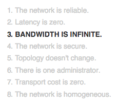
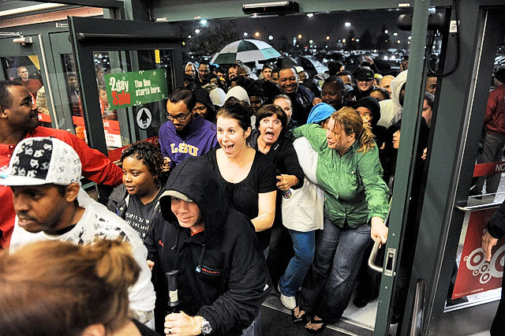
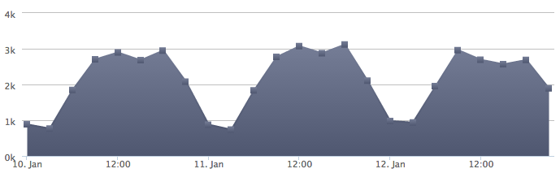
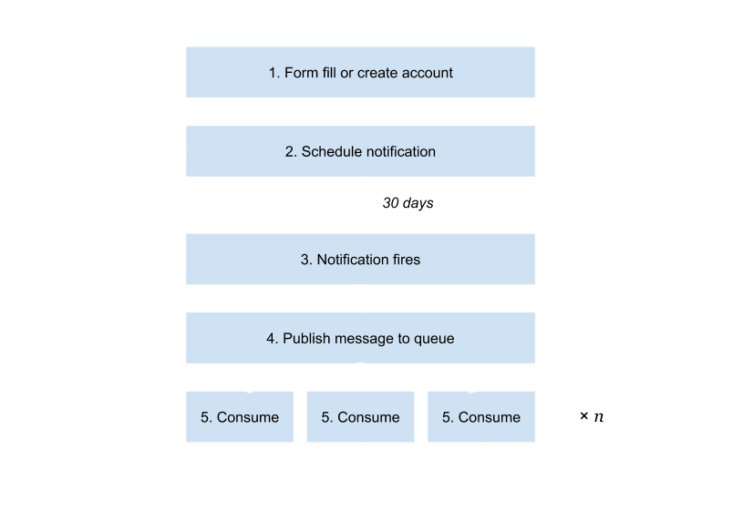

- title : Pulse Architecture
- description : Pulse Engineering
- author : Nick Blair
- theme : moon
- transition : zoom

***

## Pulse Architecture

***

Once a month, for every customer, score and send an email

' hd takes 2.4 seconds to process an individual
' exact target takes 3.3 seconds to respond to sending an email
' 24 * 60 * 60 / 5.7 = 15k requests per day
' currently at 600k customers / 30 days = ~20k per day (loans + cards)

---

HD Call

~ 2.4 seconds

---

Exact Target Call

~ 3.3 seconds

---

(60 × 60 × 24) ÷ 5.7 seconds

≈ 15k customers per day

---

600k customers ÷ 30 days

≈ 20k customers per day

' even if we only do HD Calling / solve just the hd problem
' 24 * 60 * 60 / 2.4 = 36k requests per day
' will take 1080k customers before we reach maximum throughput per day
' won't be long before we reach this limit
' going to have to parallelize reprocessing (scale)
' but! we cannot not send an infinite number of requests to HD at the same time DOS

---

Just call HD 

(60 × 60 × 24) ÷ 2.4 seconds

≈ 36k customers per day

---

36k customers per day × 30 days

≈ 1'080k max customers per month

---
- data-background : images/parallelize3.png

### Parallel Processing

---

## ⚠️

Fallacies of distributed computing

---

## ⚠️

Denial of service

---

### Defensive Programming

---

### Allow for outages

---

### Architectural Requirements

fault tolerant

pausable

parallel processing (with care!)

***

## 🔍

### Pull Approach 

' (batch processing)
' refer to requirement / 'get' all the customers
' periodically query for customers who we are supposed to process, then process them
' easy to implement, query simple to define by date of when they were last processed
' easy to retry when a problem occurs, easy to pause processing when there is some issue
' inefficient process, have to finely tune the timing otherwise time is lost (36k limit assumes every second of day is used)
' easy to control parallelism but hard to know which customers are currently being processed without introducing very granular state management
' leads to having lots of complexity in the database, locks, transactions etc

---

## 🔍 

✔ fault tolerant

---

## 🔍 

✔ pausable

---

## 🔍 

✘ parallel processing

***

## 🛎

### Push approach 

' reactive processing reactive vs proactive
' every individual customer gets given a precise time to be processed (scheduling) distributed according to create time
' the application gets notified everytime someone needs to be processed
' when processing is finished, assign a new processing time for next month. constant cycle.
' parallelizing is baked in, doesn't matter if multiple customers are scheduled for the same application
' x error handling. If something goes wrong during processing how do we recover? Will that person fall off the cycle?
' x pausing processing. If there is some issue with hd can we pause and continue later without missing customer's scheduled data?
' x too much parallism. Cumulative effect of customers being processed in the evening. Could unwittingly exhaust hd's resource to serve requests.

---

## 🛎

✔ parallel processing

---

## 🛎

✘ fault tolerant

---

## 🛎

✘ pausing

---

## 🛎

✘ over parallelism

---

---

***

## 📮

### Message Queues

' msg queues help by capturing and storing the intent to do perform some action
' queues have multiple publishers and multiple consumers
' a message remains on a queue indefinitely until it is consumed
' a message will only be consumed once - implies that a message is 'acknowledged' in order for it to be removed

' Pausing. we can continue to react to processing notifications by placing a message on a queue, even when HD is down as consumers can be stopped and started
' Error handling. if there is a problem in processing the message is not acknowledged and remains on the queue to be processed again, doesn't fall off the cycle
' throttling. we decide on the number of consumers to the queue and therefore prevent unlimited parallel calls to hd.
' if multiple processing notificatons happen to be sent at the same time, there are simply 'queued' up
' same technique can be applied to the exact target part of the processing

---

## 🛎 + 📮 

✔ fault tolerant

---

## 🛎 + 📮 

✔ pausing

---

## 🛎 + 📮 

✔ parallel processing

---

## 🛎 + 📮 

✔ throttling

***

---

[Live feed](http://internal-vpc-lb-pulse-customer-1931985984.eu-west-1.elb.amazonaws.com:5002/hangfire) 

---

## 🔍 

✘ scalable

---
 
## 🛎 + 📮 = ️️❤️

---

## Fin